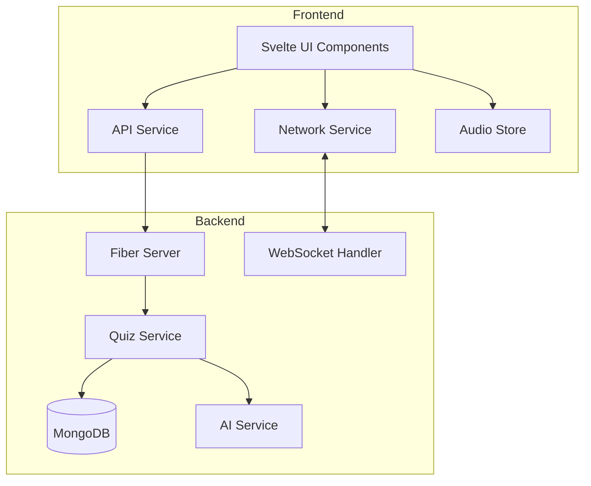
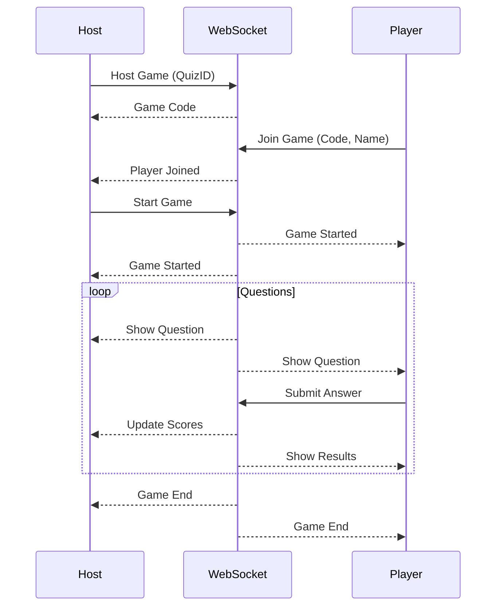
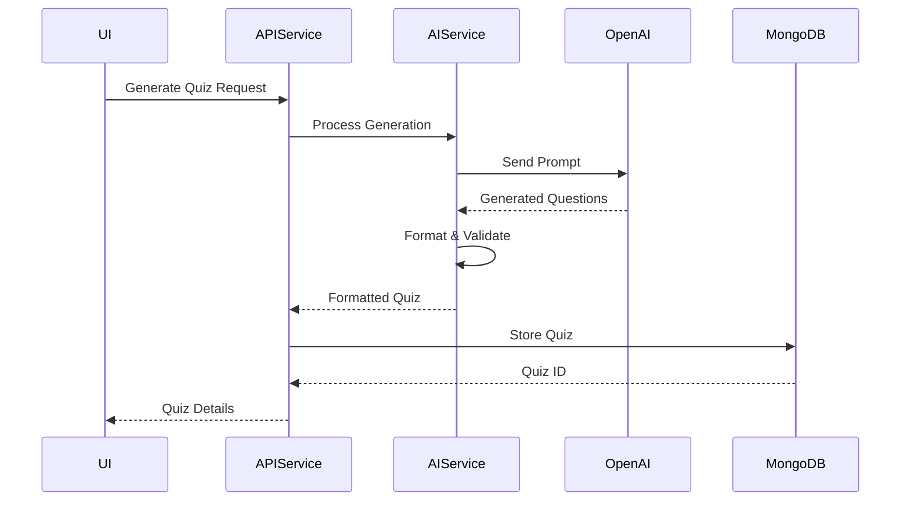

# AI Quiz Generation Platform

An AI Quiz Generation Platform that aims to leverage AI to curb a lower user base - similar to Kahoot. 

## What This Does

Uses a ChatGPT wrapper to fetch JSON data related to to whatever prompt the user asks on the frontend. Coded in Svelte (frontend) and Golang (backend) this project aims to provide teachers a solution to many features paywall blocked by Kahoot and other websites.

## Dependencies
1. **Golang and Nodejs**: Ensure Golang and Nodejs are installed on your computer
2. **MongoDB**: Download MongoDB 
3. **Vite**: Move into frontend directory, run: npm install vite --save-dev
4. **ChatGPT**: Move into \backend\internal\service\gen.go\NewAIService and paste your API key into apiKey := "YOUR KEY"

## How to Use This Repo

1. **Install Dependencies**: Ensure all dependencies are installed
3. **Paste API Key**: Move into \backend\internal\service\gen.go\NewAIService and paste your API key into apiKey := "YOUR KEY" 
4. **Run Program**: Open a terminal in the frontend and run: **npm run dev**. Open another terminal in \backend\cmd\quiz\ and run: **go run .**
5. **Check Localhost**: On a browser, go to localhost:5173

# Code Logic and Architecture

## Overall Flow
The application follows a comprehensive flow for quiz generation and management:

1. **User Journey**
- Users can choose between manual quiz creation or AI-generated quizzes
- AI generation path includes input validation before processing
- Both paths lead to a unified quiz editor interface
- Final quizzes are saved in MongoDB

## Architecture Components

### High-Level Architecture

### Network Communication Flow

### AI Quiz Generation Flow

## Security Considerations

- API key management
- Input validation
- Data sanitization
- Secure MongoDB connections

## Future Enhancements

1. Real-time collaboration
2. Advanced quiz templates
3. Analytics dashboard
4. Export functionality
5. Custom AI model integration

## Contributing

1. Fork the repository
2. Create feature branch
3. Commit changes
4. Push to branch
5. Create Pull Request

## MIT License

Copyright (c) 2024 Pennsylvania State University

Permission is hereby granted, free of charge, to any person obtaining a copy
of this software and associated documentation files (the "Software"), to deal
in the Software without restriction, including without limitation the rights
to use, copy, modify, merge, publish, distribute, sublicense, and/or sell
copies of the Software, and to permit persons to whom the Software is
furnished to do so, subject to the following conditions:

The above copyright notice and this permission notice shall be included in all
copies or substantial portions of the Software.

THE SOFTWARE IS PROVIDED "AS IS", WITHOUT WARRANTY OF ANY KIND, EXPRESS OR
IMPLIED, INCLUDING BUT NOT LIMITED TO THE WARRANTIES OF MERCHANTABILITY,
FITNESS FOR A PARTICULAR PURPOSE AND NONINFRINGEMENT. IN NO EVENT SHALL THE
AUTHORS OR COPYRIGHT HOLDERS BE LIABLE FOR ANY CLAIM, DAMAGES OR OTHER
LIABILITY, WHETHER IN AN ACTION OF CONTRACT, TORT OR OTHERWISE, ARISING FROM,
OUT OF OR IN CONNECTION WITH THE SOFTWARE OR THE USE OR OTHER DEALINGS IN THE
SOFTWARE.
